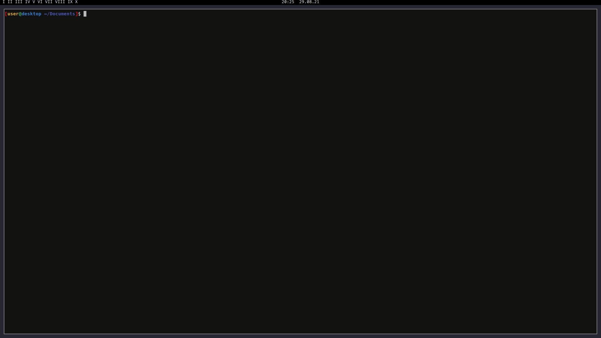

.. role:: bash(code)
   :language: bash

==================
NixOS MCPELauncher
==================

MCPELauncher-client wrapped in a Nix flake

----
Demo
----

--------
Building
--------

Make sure your system has flake support:

.. code:: nix

  {
    nix = {
      package = pkgs.nixUnstable;

      extraOptions = ''
        experimental-features = nix-command flakes
      '';
    };
  }
  
Then clone the repository and run :bash:`nix build`, once complete you should have a result folder which symlinks to a script 
in the nix store which you can run to start the launcher.

------------------
Installing (Local)
------------------

For those who would rather not break nix-env, run :bash:`nix-env -if .`

This uses flake-compat, thanks edolstra for their work.

----------------------
Installing (Local) NEW
----------------------

Make sure your system has support for flakes & ca-references:

.. code:: nix

  {
    nix = {
      package = pkgs.nixUnstable;

      extraOptions = ''
        experimental-features = nix-command flakes ca-references
      '';
    };
  }

then run :bash:`nix profile install /path/to/flake.nix`

-------------------
Installing (Global)
-------------------

If you would like to install it globally, add the following to your system configuration:

.. code:: nix

  {
    environment.systemPackages = {
      <flake>.defaultPackage.<arch>
    };
  }

----------------
Platform Support
----------------

Nix-Darwin is a no go.

Supports all platforms by the launcher:

- x86_64
- i386
- arm
- arm64
